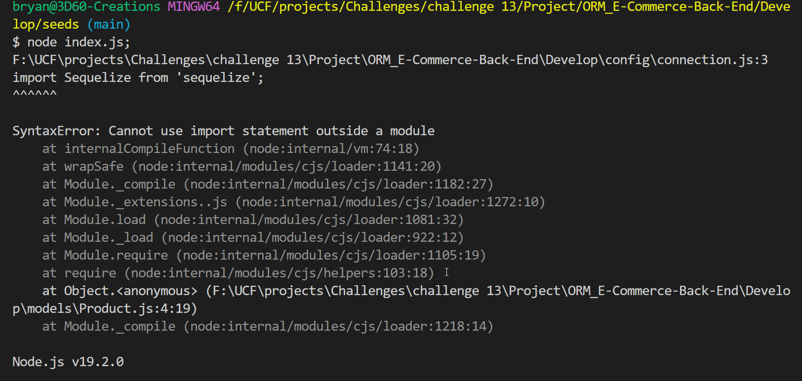

# ORM E-Commerce-Back-End

## Table of Contents

---

- [ORM E-Commerce-Back-End](#orm-e-commerce-back-end)
  - [Table of Contents](#table-of-contents)
  - [Project Description](#project-description)
  - [Installation and Test Instructions](#installation-and-test-instructions)
  - [E-Commerce-Back-End Demo Images](#e-commerce-back-end-demo-images)
  - [Note](#note)
  - [I got this error as shown in the image below....](#i-got-this-error-as-shown-in-the-image-below)
  - 
  - [E-Commerce-Back-End Demo Video](#e-commerce-back-end-demo-video)
  - [Inquire](#inquire)
  - [MIT License](#mit-license)

## Project Description

---

Internet retail, also known as **e-commerce**, is the largest sector of the electronics industry, generating an estimated $29 trillion in 2019. E-commerce platforms like Shopify and WooCommerce provide a suite of services to businesses of all sizes. Due to their prevalence, understanding the fundamental architecture of these platforms will benefit you as a full-stack web developer.

Your task is to build the back end for an e-commerce site by modifying starter code. You’ll configure a working Express.js API to use Sequelize to interact with a MySQL database.

Because this application won’t be deployed, you’ll also need to provide a link to a walkthrough video that demonstrates its functionality and all of the acceptance criteria being met. You’ll need to submit a link to the video and add it to the readme of your project.

---

## Installation and Test Instructions

---

- MySQ2
- Express.js
- Inquirer Package
- dotenv

---

---

## E-Commerce-Back-End Demo Images

---
##  Note 

## I got this error as shown in the image below.... 
  

---

---

## E-Commerce-Back-End Demo Video

---
 
<"">

---

## Inquire

---
Feel free to contact me at bryanq2008@live.com with any questions about this project. Visit <https://github.com/Bryan3D> to see more of my projects.

## MIT License

---

Copyright (c) [2023] [ORM: E-Commerce-Back-End by Bryan A Quero]

Permission is hereby granted, free of charge, to any person obtaining a copy
of this software and associated documentation files (the "Software"), to deal
in the Software without restriction, including without limitation the rights
to use, copy, modify, merge, publish, distribute, sublicense, and/or sell
copies of the Software, and to permit persons to whom the Software is
furnished to do so, subject to the following conditions:

The above copyright notice and this permission notice shall be included in all
copies or substantial portions of the Software.

THE SOFTWARE IS PROVIDED "AS IS", WITHOUT WARRANTY OF ANY KIND, EXPRESS OR
IMPLIED, INCLUDING BUT NOT LIMITED TO THE WARRANTIES OF MERCHANTABILITY,
FITNESS FOR A PARTICULAR PURPOSE AND NONINFRINGEMENT. IN NO EVENT SHALL THE
AUTHORS OR COPYRIGHT HOLDERS BE LIABLE FOR ANY CLAIM, DAMAGES OR OTHER
LIABILITY, WHETHER IN AN ACTION OF CONTRACT, TORT OR OTHERWISE, ARISING FROM,
OUT OF OR IN CONNECTION WITH THE SOFTWARE OR THE USE OR OTHER DEALINGS IN THE
SOFTWARE.
